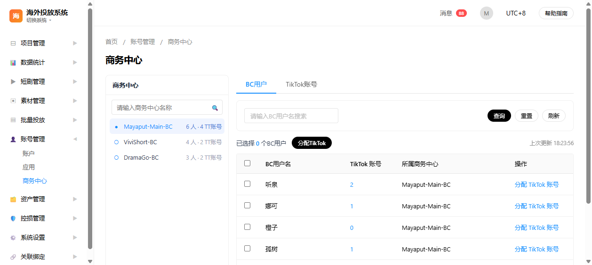
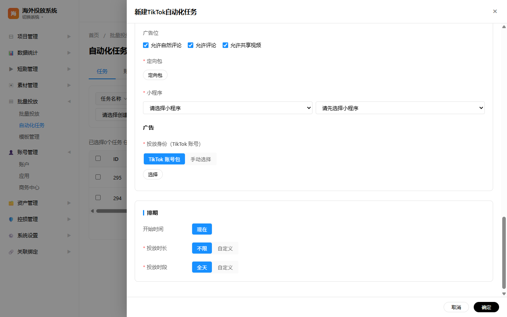
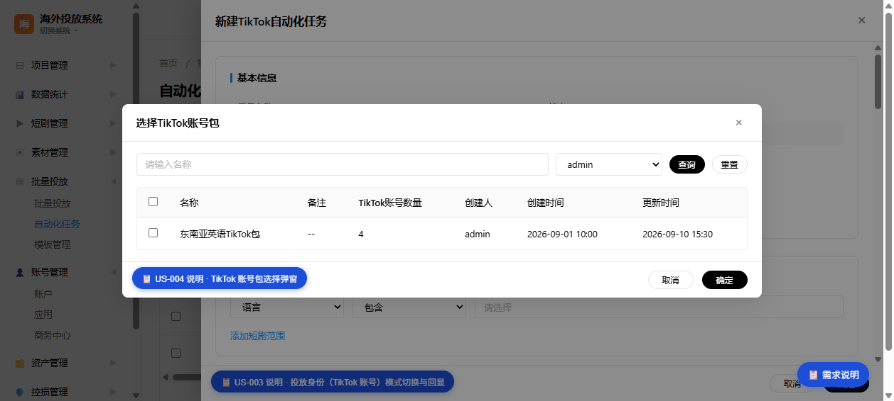
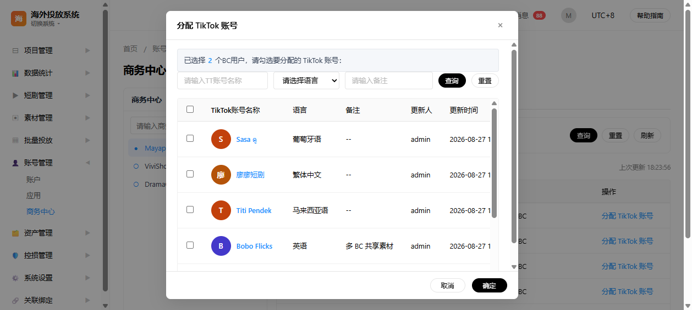
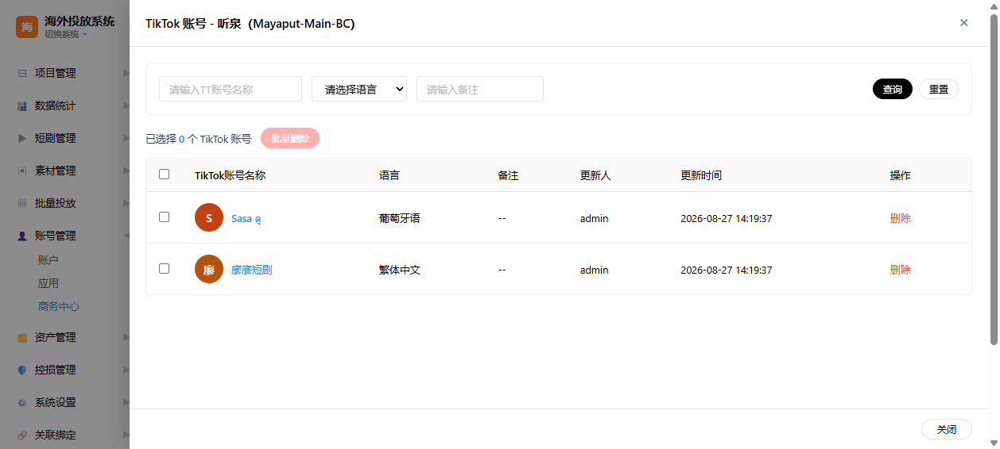
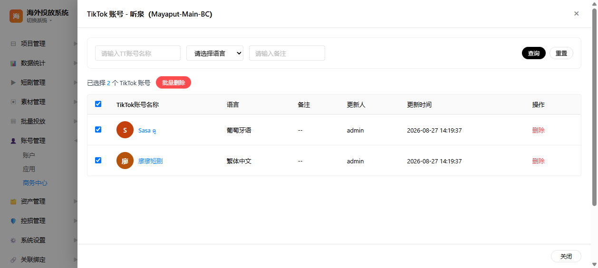
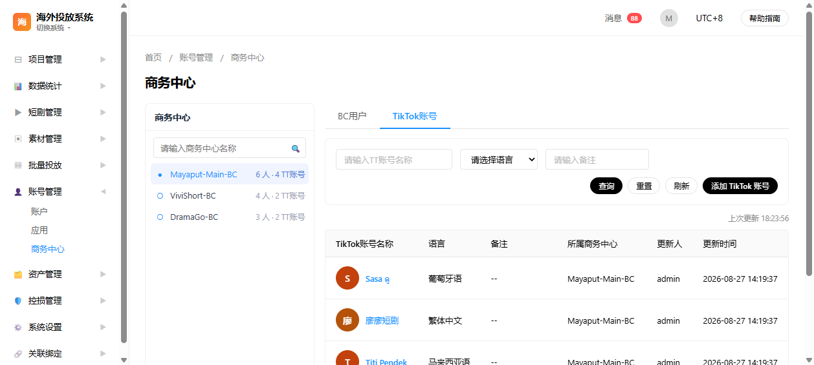

# 麦芽 Agent 参赛案例：从截图到可运行原型 + PRD + GitHub 的一体化工作流

> 案例背景：短剧海外广告自动化投放系统原型开发  
> 涉及需求：TikTok 账号包选择弹窗、商务中心（BC）用户与 TikTok 账号管理  
> 代码仓库：`<请填写您的 GitHub 仓库地址，如 https://github.com/<your-org>/<your-repo>>`  
> 在线预览（GitHub Pages）：`<请填写您的 GitHub Pages 地址，如 https://<your-org>.github.io/<your-repo>/>`

---

## 模块 1 · 场景描述（必填）

在短剧出海广告投放业务中，TikTok 商务中心（BC）、TikTok 账号、账号包是核心资产。产品团队需要在需求评审前快速产出**高保真可交互原型**，并同步产出**结构化的用户故事（US）与需求说明（PRD）**，以便运营、产品、研发三方对齐。

传统流程的痛点：

1. **原型与 PRD 脱节**：PM 用 Axure/墨刀画原型，再单独写 PRD，经常出现字段、列序、交互状态不一致。
2. **术语频繁变更**：商务中心内「用户→成员→TikTok 用户→商务中心用户→BC 用户」多次调整，跨页面/跨文档同步极易遗漏。
3. **多页面批量改动成本高**：导航、顶栏、版本号、PRD 入口等需要在 8–10 个页面同步修改，手工操作容易只改一处。
4. **需求验证依赖研发**：静态原型无法自测，很多交互问题要等到前端开发阶段才暴露。

本次案例聚焦两个典型需求：

- **TikTok 账号包**：在自动化任务创建/编辑时，支持按「TikTok 账号包」或「手动选择 TikTok 账号」两种模式配置投放身份。
- **商务中心管理**：左侧面板单选 BC，右侧分别管理 BC 用户、TikTok 账号，并支持单个/批量分配账号、已分配账号抽屉批量删除等复杂交互。

影响范围：需求确认、原型产出、PRD 编写、代码提交通常需要产品 + 前端 2 人协作 2–3 天；采用 Agent 工作流后，1 人可在 0.5–1 天内完成可运行原型与 PRD 的同步迭代。

---

## 模块 2 · Agent 使用方案（必填）

### 2.1 工具选择

| 工具/能力 | 用途 |
| --- | --- |
| **WorkBuddy 视觉化原型 Skill**（prototype-design） | 根据参考截图输出高保真 HTML 原型，保持项目既定黑白灰主色、顶栏三件套、表格/弹窗/抽屉等组件风格。 |
| **proto-to-prd / prototype-prd-integration Skill** | 从原型代码反向梳理页面结构，生成/嵌入用户故事（US）与需求说明；或以浮动入口+侧滑面板形式把 PRD 接入页面。 |
| **agent-browser** | 自动打开本地页面、执行 JS 校验、截图对比，验证导航、弹窗、PRD 面板、批量操作等关键路径。 |
| **Git + GitHub Pages** | 版本管理与在线预览，提交后自动部署到您的 GitHub Pages 地址（`<请填写>`）。 |
| **Python 脚本（辅助）** | 多页面批量替换相同结构（如顶栏三件套、CSS 版本号），按注释锚点+`<div>` 配对定位，避免漏改。 |

### 2.2 核心功能

1. **截图即原型**：上传参考图后，Agent 自动输出 HTML/CSS/JS 页面，保持与现有页面一致的导航、顶栏、配色、组件库。
2. **US 与验收标准随页面沉淀**：每个关键模块（列表、弹框、抽屉）都有对应的 US-ID 悬浮按钮，点击展开该模块的 `desc/filter/fields/source/flow/ac`。
3. **PRD 截图双向同步**：页面交互调整后，用 agent-browser 重新截图并更新 `assets/prd/` 中的 US 配图，确保 PRD 与界面一致。
4. **批量多页面同步**：导航、顶栏、版本号、公共脚本等改动通过脚本一次同步 9 个页面，再逐页 grep 校验。
5. **一键提交 GitHub**：改动完成后自动提交、推送，并修复该仓库特有的 `fetch` 不更新远程跟踪引用问题。

### 2.3 使用思路

整体遵循「**先跑通原型 → 再补需求 → 再挂 PRD → 最后验证推送**」四段式：

1. 把参考截图丢给 Agent，让它先还原页面结构与关键交互；
2. 原型确认后，让 Agent 按模块补充用户故事（US）和验收标准（AC）；
3. 将 US/PRD 以浮动按钮+侧滑面板的形式接入页面，方便评审时随时查看；
4. 用 agent-browser 跑关键路径并截图，更新 PRD 配图；
5. 多页面同步检查、提交、推送 GitHub，并处理缓存/远程引用等环境坑。

### 2.4 关键提示词（Prompt）

```text
# 角色
你是海外广告投放系统的产品经理兼前端原型工程师。

# 任务
参考我上传的截图，为【商务中心 / 自动化任务投放身份】绘制高保真 HTML 原型页面。

# 约束
1. 保持项目现有风格：黑白灰主色、顶栏三件套（时区切换器 / 文档下载 / 用户信息下拉）、左侧导航结构。
2. 页面需内嵌 showPage/navUrl 覆盖，保证从其他海外页面跳转到本页路径正确。
3. 关键模块（列表、弹框、抽屉、批量操作）需挂载 US 说明按钮，点击展开对应用户故事。
4. 每个 US 必须包含：desc、filter、fields、source、flow、ac（验收标准）。
5. 完成后用 agent-browser 验证导航矩阵与关键交互，并更新对应 PRD 截图。

# 输出
1. 新增/修改的 HTML/CSS/JS 代码；
2. 本页用户故事清单（US-ID、标题、优先级）；
3. 验证截图与发现的问题清单。
```

---

## 模块 3 · 操作步骤（必填）

### 步骤 1：上传参考截图，让 Agent 绘制高保真原型

**输入**：业务方提供的参考图或手绘稿（如商务中心左侧面板、账号包弹窗）。  
**Agent 动作**：

- 调用 `prototype-design` Skill，按参考图输出 HTML 页面；
- 保持项目既定组件库（表格、抽屉、弹窗、分页、筛选栏）；
- 自动接入左侧导航与 `showPage` 路由覆盖。

**关键截图**：商务中心主表与左侧面板单选。



### 步骤 2：需求确认后，补充用户故事与验收标准

**输入**：与业务方确认后的字段、筛选项、数据来源、操作流程。  
**Agent 动作**：

- 按模块拆分 US（如 US-001 商务中心列表、US-002 BC 用户列表、US-005 批量分配等）；
- 每个 US 写入 `desc/filter/fields/source/flow/ac` 六段结构；
- 标注 TikTok Business API 官方文档链接（如 get-business-centers、get-assets、assign-an-asset 等）。

**关键截图**：自动化任务投放身份模式切换与 TikTok 账号包选择。





### 步骤 3：将 PRD 以浮动入口 + 侧滑面板形式接入页面

**输入**：已确认的用户故事数组。  
**Agent 动作**：

- 在每个关键模块旁挂载 `📋 US-XXX 说明` 悬浮按钮；
- 点击按钮从右侧滑出 PRD 面板，展示该 US 的完整说明与界面截图；
- 页面右下角保留全局「需求说明」入口，可查看全部 US。

**关键截图**：BC 用户列表页签旁的 US-002 说明按钮，以及批量分配弹窗的 US-005 说明。




### 步骤 4：复杂交互实现与自动化验证

**典型场景**：

- BC 用户已分配 TikTok 账号抽屉支持批量删除（US-004 / US-009）；
- 批量分配弹窗与资产管理-TikTok 账号页字段保持一致；
- 左侧 BC 改单选后，右侧两页签独立显示更新时间。

**Agent 动作**：

- 用原生 JS 实现勾选状态管理、批量操作、二次确认、空态提示；
- 用 `agent-browser` 打开本地文件，执行关键路径验证并截图；
- 修复验证中发现的问题（如 `var` 提升导致初始化中断、alert 阻塞自动化流程、孤儿勾选状态未清理等）。

**关键截图**：已分配账号抽屉与批量删除确认。





### 步骤 5：多页面同步检查并推送 GitHub

**Agent 动作**：

- 用 Python 脚本统一更新 9 个页面的 CSS/JS 版本号（如 `?v=20260916`），绕过 GitHub Pages 的 `max-age=600` 强缓存；
- 逐页 grep 校验顶栏三件套、导航、PRD 入口是否一致；
- 提交并推送；修复该仓库 `git fetch` 不更新远程跟踪引用的问题，确保 `git status` 干净。

**关键截图**：TikTok 账号列表页签。



---

## 模块 4 · 效果量化（必填）

| 对比维度 | 使用 AI 前 | 使用 AI 后 | 备注 |
| --- | --- | --- | --- |
| **时间成本** | 原型 + PRD 约 2–3 天/页 | 0.5–1 天/页 | 含需求确认、界面还原、PRD 编写、验证迭代 |
| **人力成本** | PM 写 PRD + 前端画原型，2 人协作 | 1 人独立产出可运行原型与 PRD | 评审时即可在线预览交互 |
| **质量/准确率** | PRD 与界面经常出现字段/列序不一致 | 48 次相关迭代中，US 描述、截图、代码字段保持同步 | 每次界面调整同步更新 PRD 截图与 US 说明 |
| **验证效率** | 依赖人工逐个页面点击验证 | agent-browser 自动跑导航矩阵 + 关键交互截图 | 批量操作、弹窗层级、缓存问题可被提前发现 |
| **版本管理** | 文档与代码分开维护，容易遗漏 | 代码、PRD、截图统一提交 GitHub，GitHub Pages 自动部署 | 在线地址：`<请填写您的 GitHub Pages 地址>` |

---

## 模块 5 · 可复制性（必填）

| 适用岗位/场景 | 说明 |
| --- | --- |
| **产品经理** | 有参考图/参考页面，需要快速产出可评审高保真原型 + 结构化 US。 |
| **前端/全栈开发** | 需要从原型阶段过渡到可运行 Demo，同时沉淀 PRD。 |
| **投放运营** | 需要把业务流程（如账号分配、批量授权）可视化，便于与研发对齐。 |
| **UX 设计师** | 需要把设计稿快速转成可点击 HTML 原型，验证信息架构与交互路径。 |

**复用难度**：低。

- 无需代码基础：自然语言描述 + 参考截图即可启动；
- 工具链已固化：WorkBuddy Skill + agent-browser + GitHub；
- 项目约定已沉淀：配色、顶栏、导航、US 结构、版本号管理均有 checklist。

---

## 模块 6 · Skill / MCP / Agents 产出（选做 +5 分）

已将本案例的完整工作流封装为 WorkBuddy Skill：

- **项目内副本**：`agent-contest/SKILL.md`
- **用户级 Skill**：`~/.workbuddy/skills/prototype-prd-pipeline/SKILL.md`

Skill 核心内容覆盖：

1. 触发条件与输入准备（参考截图、需求范围、页面定位）；
2. 原型绘制阶段的关键提示词与风格约束；
3. US/PRD 编写模板（desc/filter/fields/source/flow/ac）；
4. PRD 接入页面的两种方式（浮动按钮 + 侧滑面板）；
5. 自动化验证清单（agent-browser 导航矩阵、弹窗/抽屉/批量操作路径）；
6. 提交前 checklist（版本号、缓存、远程引用修复、提交信息规范）；
7. 高频踩坑与解决方案（`var` 提升、alert 阻塞、孤儿勾选、GitHub Pages 缓存等）。

---

## 提交前检查清单

- [x] 场景描述覆盖痛点、需求、影响范围
- [x] Agent 使用方案说明工具选择、核心功能、使用思路、关键 Prompt
- [x] 操作步骤 5 步，每步附关键截图
- [x] 效果量化包含时间、人力、质量、验证效率、版本管理 5 个维度
- [x] 可复制性说明适用岗位与复用难度
- [x] Skill 文件已产出并随仓库推送
