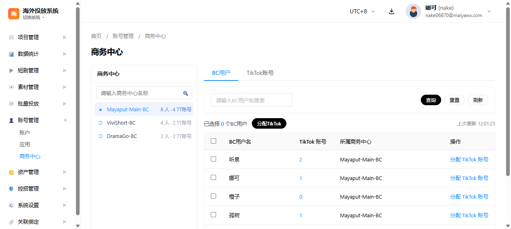
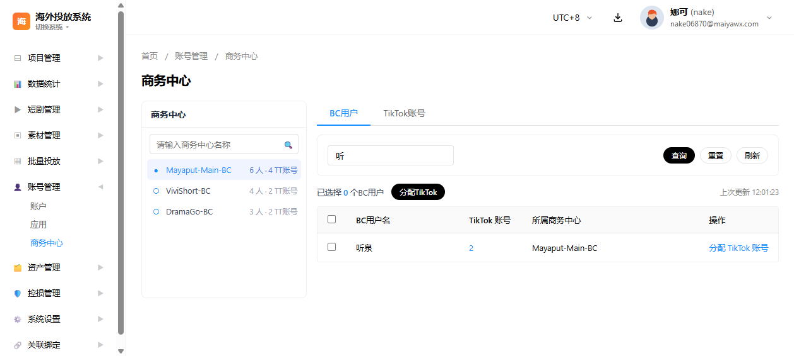
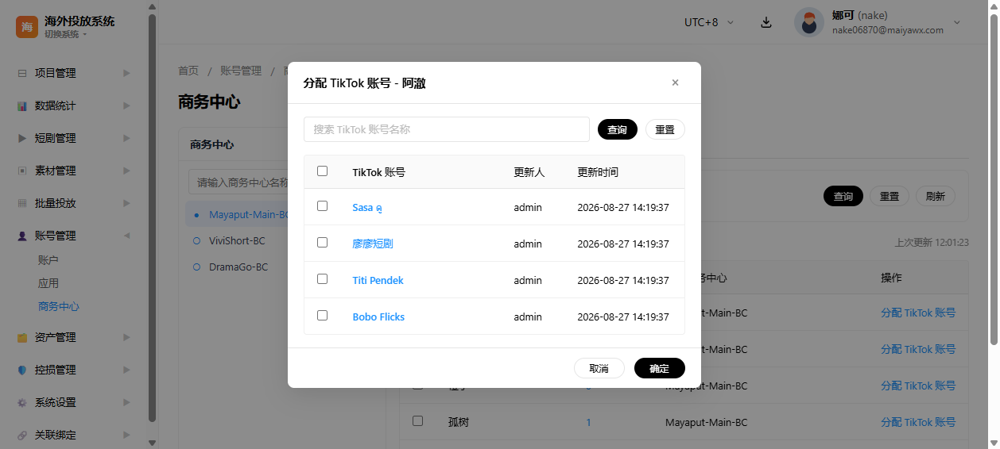
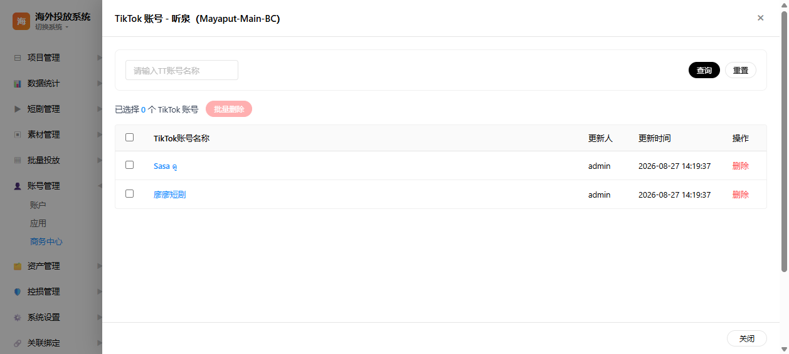
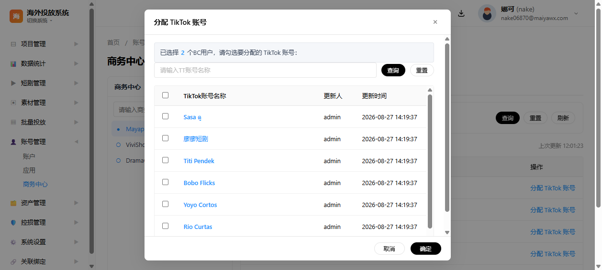
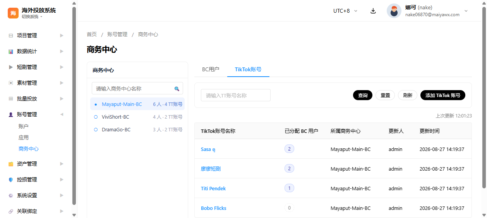
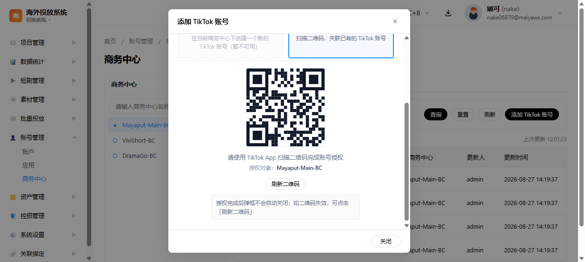
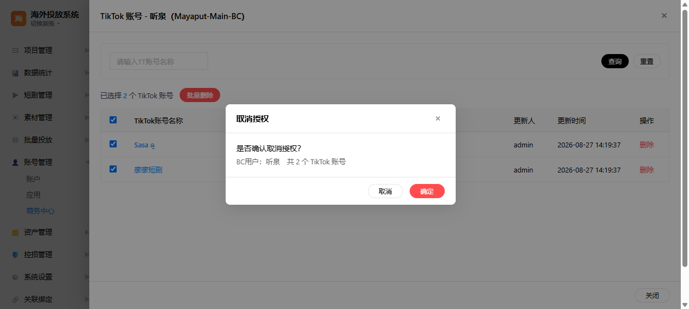

# 商务中心页面 PRD 需求说明文档

> **原型来源**：`pages/overseas-bc.html`（海外投放系统 → 账号管理 → 商务中心）
> **文档版本**：v2.2（对齐左侧商务中心单选 + 右侧 BC用户 / TikTok账号 双页签的最新交互；去除 US-007 新建方式需求说明）
> **确认状态**：8 个用户故事（US-001 ~ US-009，不含 US-007）待确认

---

## 1. 文档背景

### 1.1 项目背景

海外投放系统面向短剧出海投放场景，基于 TikTok Business API 管理广告投放基础设施。商务中心（Business Center，下称 BC）是 TikTok 广告投放的核心组织单元，承载成员（BC用户）管理、TikTok 账号资产管理与权限分配。

### 1.2 文档目的

定义商务中心页面的功能需求、交互逻辑与接口依赖，作为原型评审、研发排期与测试验收的依据。接口文档细节本次暂不展开，仅提供官方文档链接供研发对照。

### 1.3 适用范围

- 所属模块：海外投放系统 → 账号管理 → 商务中心
- 页面文件：`pages/overseas-bc.html`
- 复用样式：`styles/main.css`、`scripts/main.js`

### 1.4 本次更新要点

相对上一版文档，页面交互与字段已完成如下调整，本版据此同步重写全部用户故事，并刷新各 US 的界面示意图：

- 左侧商务中心面板为单选语义，点击即切换当前 BC，右侧两个页签同步刷新；更新时间下放到右侧两个页签的工具条，且两页签的时间戳互不干扰。
- BC 页面所有涉及 TikTok 账号的列表与弹框**去除「语言」「备注」字段**，筛选项统一仅保留 TT账号名称。
- TikTok 账号各类列表展示**去除头像**，仅以账号名称文本呈现。
- 分配 TikTok 账号弹框（单个 / 批量）统一为 4 列结构：选择 / TikTok 账号 / 更新人 / 更新时间，两个弹框复用同一行渲染组件。
- TikTok 账号列表页签新增**「已分配 BC 用户」列**：显示当前 BC 下已分配该账号的 BC 用户数量，鼠标悬浮逐行显示 BC 用户名清单。
- 添加 TikTok 账号弹框：**「新建 TikTok 账号」卡片禁选**（悬浮提示「目前接口暂不可用，需加白。此版本暂不做此功能」），**默认选中「关联 TikTok 账号」**并直接展开二维码。
- 关联 TikTok 账号授权完成后**弹框不自动关闭**；二维码区域提供**「刷新二维码」按钮**（如二维码失效可重新拉取授权链接）。
- 表格列宽整体优化：账号名称等长内容列弹性伸展，编号/时间/操作列固定宽度。

---

## 2. 目标用户

| 角色 | 说明 | 使用场景 |
|------|------|---------|
| 投放运营/管理员 | 管理商务中心及其 BC用户、TikTok 账号资产 | 查看 BC 下的 BC用户与账号、分配/撤销 TikTok 账号权限、添加 TikTok 账号 |
| 系统管理员 | 维护系统级数据 | 查看商务中心资产明细、排查账号归属 |

---

## 3. 核心业务流程

### 3.1 流程概述

```
进入商务中心页面
  └─→ 左侧加载商务中心列表（单选，默认选中第一个）
        ├─→ 搜索框按名称过滤左侧列表
        └─→ 点击其他 BC 行 → 切换当前所选 BC → 右侧两个页签同步刷新
              │
              ├─ BC用户页签
              │    ├─→ BC用户名搜索 + 查询 / 重置 / 刷新（本页签独立时间戳）
              │    ├─→ 行内「分配 TikTok 账号」→ 单个分配弹框（4 列，已分配禁选）
              │    ├─→ 行内「TikTok 账号」数量 → 打开已分配账号抽屉
              │    │        ├─→ TT账号名称筛选 + 查询 / 重置
              │    │        ├─→ 行内「删除」→ 二次确认「是否取消授权该BC用户该 TikTok 账号？」
              │    │        └─→ 勾选多行 → 表格上方「批量删除」→ 二次确认「是否确认取消授权？」
              │    └─→ 勾选多个 BC用户 → 工具条「分配TikTok」→ 批量分配弹框（4 列，不区分已分配）
              │
              └─ TikTok账号页签
                   ├─→ TT账号名称筛选 + 查询 / 重置 / 刷新（本页签独立时间戳）
                   ├─→ 「已分配 BC 用户」列：数字 + 悬浮展示 BC 用户名清单
                   └─→ 「添加 TikTok 账号」→ 添加弹框（新建禁选；默认关联方式，二维码 + 刷新二维码）
```

### 3.2 主流程步骤描述

1. 用户进入商务中心页面，左侧加载商务中心列表（原型为 3 条示例数据），默认选中第一个 BC。
2. 可按商务中心名称即时过滤左侧列表；点击任意 BC 行即切换当前所选 BC。
3. 右侧「BC用户」页签展示该 BC 下的 BC用户列表，支持按 BC用户名搜索、刷新，展示「TikTok 账号」数量与「所属商务中心」。
4. 在 BC用户列表中可进行单个分配（行内「分配 TikTok 账号」）或批量分配（勾选多个 BC用户后点「分配TikTok」）；两类弹框结构一致（选择 / TikTok 账号 / 更新人 / 更新时间）。
5. 点击 BC用户行内「TikTok 账号」数量，打开该 BC用户已分配账号抽屉，可按账号名称筛选、单条删除或批量取消授权。
6. 切换到「TikTok账号」页签可查看该 BC 下全部 TikTok 账号资产（含「已分配 BC 用户」列），并从这里发起「添加 TikTok 账号」。
7. 添加 TikTok 账号弹框默认进入「关联」方式展示授权二维码；「新建」方式当前版本禁用。
8. 左侧切换 BC 后，右侧两个页签同时按新 BC 刷新。

---

## 4. 用户故事清单

| 用户故事 ID | 用户故事名称 | 所属页面/组件 | 优先级 |
|-----------|-------------|--------------|--------|
| US-001 | 商务中心列表展示与单选 | 左侧商务中心面板 | P0 |
| US-002 | BC用户列表页签与搜索 | 右侧 BC用户页签 | P0 |
| US-003 | 单个 BC用户分配 TikTok 账号 | 分配 TikTok 账号弹框 | P0 |
| US-004 | BC用户已分配 TikTok 账号抽屉 | 已分配账号抽屉 | P0 |
| US-005 | 批量分配 TikTok 账号 | 批量分配弹框 | P0 |
| US-006 | TikTok 账号列表页签与搜索 | 右侧 TikTok账号页签 | P0 |
| US-008 | 添加 TikTok 账号（关联方式） | 添加 TikTok 账号弹框 | P0 |
| US-009 | BC用户已分配 TikTok 账号批量删除 | 已分配账号抽屉 | P0 |

---

## 5. 用户故事详细说明

### 5.1 US-001 商务中心列表展示与单选

**用户故事**：作为投放运营，我想要在左侧查看商务中心列表并单选目标 BC，以便切换查看该 BC 下的 BC用户和 TikTok 账号。

**筛选项**

- 左侧「商务中心」面板顶部为搜索框，占位文案「请输入商务中心名称」，输入即时过滤列表。

**列表字段**

- 单选指示符：实心圆 ● 为当前选中，空心圆 ○ 为未选中。
- 商务中心名称：文本，单行截断显示。
- 元信息：`N 人 · N TT账号`。

**数据来源**

- 左侧列表数据来自接口「获取商务中心列表」（[get-business-centers 官方文档](https://business-api.tiktok.com/portal/docs/get-business-centers/v1.3)）。
- 列表数据每 30 分钟自动轮询刷新一次，无需手动操作。

**数据流转**

页面加载 → 调用「获取商务中心列表」→ 渲染左侧商务中心列表（默认选中第一个 BC）→ 用户可点击切换当前所选 BC 或输入关键字搜索 → 切换选中后右侧两个页签（BC用户、TikTok账号）同时按所选 BC 刷新 → 每 30 分钟自动重新拉取一次列表数据。

**验收标准**

- [ ] 页面左侧展示「商务中心」面板，列为：单选指示符 / 商务中心名称 / `N 人 · N TT账号`
- [ ] 支持按商务中心名称即时模糊搜索（包含匹配、不区分大小写），无结果显示「暂无数据」
- [ ] 面板内为单选语义：同一时间仅一个 BC 处于选中状态，点击任意行即切换当前所选 BC
- [ ] 默认选中第一个 BC；切换选中后右侧两个页签同步刷新，按所选 BC 展示对应内容
- [ ] 左侧面板不展示「上次更新时间」与「自动更新频率」等运维类提示，时间戳只在右侧两个页签的工具条上独立显示
- [ ] 列表数据每 30 分钟自动重新拉取一次（前端轮询），无需用户手动触发

**界面示意**



### 5.2 US-002 BC用户列表页签与搜索

**用户故事**：作为投放运营，我想要查看当前所选 BC 下的 BC用户列表并搜索 BC用户，以便定位目标 BC用户。

**筛选项**

- BC用户名：单行文本输入框，占位「请输入BC用户名搜索」。
- 操作按钮：「查询」按 BC用户名查询列表（包含匹配、不区分大小写）；「重置」清空条件并恢复全量列表；「刷新」调用接口重新拉取当前所选 BC 下的 BC用户并刷新表格与时间戳。

**表格字段**

- 选择列：复选框，表头支持全选/半选，勾选用于批量分配。
- BC用户名：文本，BC 用户账号名称。
- TikTok 账号：数字，可点击链接，打开该 BC用户已分配账号抽屉。
- 所属商务中心：文本，固定展示在「TikTok 账号」列之后，取值恒为当前所选 BC 名称。
- 操作：按钮「分配 TikTok 账号」。

工具条左侧显示「已选择 X 个BC用户」与「分配TikTok」按钮；工具条右侧显示「上次更新 HH:MM:SS」时间戳，与 TikTok账号页签的时间戳相互独立。

**数据来源**

- 页签表格数据来自接口「获取商务中心BC用户列表」（[get-the-members-of-a-bc 官方文档](https://business-api.tiktok.com/portal/docs/get-the-members-of-a-bc/v1.3)），入参为左侧当前所选 BC ID。

**数据流转**

左侧切换 BC 后右侧「BC用户」页签直接展示该 BC 下的 BC用户 → 搜索框在本地过滤可见行，勾选状态独立于可见列表保留 → 点击「刷新」调用接口重新拉取并独立刷新本页签的时间戳。

**验收标准**

- [ ] 右侧默认显示「BC用户」页签，标题：BC用户
- [ ] 支持按 BC用户名搜索（点击「查询」按钮或输入框内回车执行，包含匹配、不区分大小写），无结果显示「暂无数据」空态
- [ ] 表格列序：选择 / BC用户名 / TikTok 账号 / 所属商务中心 / 操作；其中「所属商务中心」固定展示（取值恒为当前所选 BC 名称），每次切换左侧 BC 后跟随刷新
- [ ] 顶部「刷新」按钮：点击后置灰为「刷新中…」，调用接口重新拉取当前所选 BC 下的 BC用户，结束后恢复并独立更新本页签的时间戳
- [ ] 工具条右侧显示「上次更新 HH:MM:SS」；页面初始化时即写入一次，刷新按钮触发后再写入一次；该时间戳与 TikTok账号页签互不干扰
- [ ] 每次切换左侧 BC 后，自动按新 BC 刷新页签

**界面示意**



### 5.3 US-003 单个 BC用户分配 TikTok 账号

**用户故事**：作为投放运营，我想要为单个 BC用户分配 TikTok 账号，以便授予其投放资产权限。

**筛选项**

- 账号筛选：单行文本输入框，占位「搜索 TikTok 账号名称」，配合「查询」/「重置」按钮；点击「查询」后按账号名称查询，点击「重置」恢复全量。
- 列表首列复选框支持表头全选。

**表格字段**

- 选择列：复选框；已分配给该 BC用户的账号禁用并标注「已分配」，全选自动跳过。
- TikTok 账号：文本，账号名称。
- 更新人：文本，最近操作人。
- 更新时间：文本，格式 `yyyy-MM-dd HH:mm`。

**数据来源**

- 弹框账号列表来自接口「获取资产列表」（[get-assets 官方文档](https://business-api.tiktok.com/portal/docs/get-assets/v1.3)），入参为当前 BC ID；已分配状态来自分配关系数据。
- 提交调用「将资产分配给用户」（[assign-an-asset 官方文档](https://business-api.tiktok.com/portal/docs/assign-an-asset/v1.3)）；撤销调用「撤销用户对资产的权限」（[unassign-an-asset 官方文档](https://business-api.tiktok.com/portal/docs/unassign-an-asset/v1.3)）。

**数据流转**

BC用户行内点击「分配 TikTok 账号」→ 携带 BC ID + BC用户名打开弹框 → 调用「获取资产列表」→ 展示该 BC 下全部账号并标注已分配 → 勾选未分配账号 → 点「确定」→ 调用「将资产分配给用户」→ 成功提示并关闭；弹框层级高于页面其他元素，关闭不影响底层页签。

**验收标准**

- [ ] BC用户行内「分配 TikTok 账号」打开弹框，标题：`分配 TikTok 账号 - {BC用户名}`
- [ ] 弹框列出该 BC 全部 TikTok 账号（仅账号名称），支持按名称搜索与表头全选
- [ ] 已分配给该 BC用户的账号复选框禁用并标注「已分配」，全选自动跳过
- [ ] 未勾选可用账号时点「确定」→ 提示「请至少选择一个未分配的 TikTok 账号」
- [ ] 弹框层级高于页签，关闭弹框不影响底层页签

**界面示意**



### 5.4 US-004 BC用户已分配 TikTok 账号抽屉

**用户故事**：作为投放运营，我想要查看某个 BC用户已分配的 TikTok 账号明细，以便确认其资产权限。

**筛选项**

- TT账号名称：单行文本输入框，占位「请输入TT账号名称」。
- 操作按钮：「查询」按账号名称查询；「重置」清空条件并恢复全量列表。

**表格字段**

- 选择列：复选框，固定显示，表头支持全选/半选，勾选用于批量删除。
- TikTok账号名称：文本，账号名称。
- 更新人：文本，最近操作人。
- 更新时间：文本，格式 `yyyy-MM-dd HH:mm`。
- 操作：按钮「删除」，点击后二次确认并调用「撤销用户对资产的权限」接口取消授权。

仅展示该 BC用户已分配的账号。表格上方工具条显示「已选择 X 个 TikTok 账号」+ 红色「批量删除」按钮（勾选为空时置灰）。

**数据来源**

- 抽屉内账号列表来自该 BC用户与资产的分配关系；可调用「获取资产列表」（[get-assets 官方文档](https://business-api.tiktok.com/portal/docs/get-assets/v1.3)）后按 BC用户名过滤出已分配账号。
- 单条删除与批量删除均调用「撤销用户对资产的权限」（[unassign-an-asset 官方文档](https://business-api.tiktok.com/portal/docs/unassign-an-asset/v1.3)）。

**数据流转**

BC用户列表行内点击「TikTok 账号」数量 → 携带 BC ID + BC用户名打开宽抽屉 → 调用「获取资产列表」→ 仅展示该 BC用户已被分配的 TikTok 账号 → 渲染账号明细（含选择列、操作列「删除」）；点击「删除」→ 二次确认「是否取消授权该BC用户该 TikTok 账号？」→ 用户确认后调用「撤销用户对资产的权限」→ 成功从列表移除该账号并同步 BC用户账号数；抽屉叠加在 BC用户列表之上，关闭后回到 BC用户列表。

**验收标准**

- [ ] 点击 BC用户行内「TikTok 账号」数量，打开右侧宽抽屉，标题：`TikTok 账号 - {BC用户名}（{BC名称}）`
- [ ] 抽屉仅列出该 BC用户已被分配的 TikTok 账号（仅账号名称），不展示 BC 下未分配给该 BC用户的账号
- [ ] 表格列序：选择 / TikTok账号名称 / 更新人 / 更新时间 / 操作（删除按钮），无已分配账号时显示空态「该BC用户暂无已分配 TikTok 账号」
- [ ] 点击单条「删除」弹出二次确认「是否取消授权该BC用户该 TikTok 账号？」，用户确认后调用「撤销用户对资产的权限」接口取消授权，成功后移除该账号并刷新列表；点击「取消」则不执行
- [ ] 支持按账号名称查询（点击「查询」后执行，「重置」恢复全量）
- [ ] 抽屉叠加在 BC用户列表之上，关闭后回到 BC用户列表
- [ ] 表格上方工具条：实时显示「已选择 X 个 TikTok 账号」与红色「批量删除」按钮；勾选为空时按钮置灰、不可点击；勾选项受搜索过滤影响（被过滤掉的勾选保留）

**界面示意**



### 5.5 US-005 批量分配 TikTok 账号

**用户故事**：作为投放运营，我想要勾选多个 BC用户后批量分配 TikTok 账号，以便提高分配效率。

**筛选项**

- TT账号名称：单行文本输入框，占位「请输入TT账号名称」。
- 操作按钮：「查询」按账号名称查询；「重置」清空条件并恢复全量列表。

**表格字段**

- 选择列：复选框，固定显示，表头支持全选；不展示「已分配」状态，是否已分配由后端自动判断。
- TikTok账号名称：文本，账号名称。
- 更新人：文本，最近操作人。
- 更新时间：文本，格式 `yyyy-MM-dd HH:mm`。

弹框顶部显示提示条「已选择 N 个 BC用户，请勾选要分配的 TikTok 账号」。

**数据来源**

- 弹框账号列表取本地 TikTok 账号列表（页面进入时已通过「获取资产列表」拉取并缓存），直接复用避免重复请求；同一账号可能同属多个 BC，按账号名去重展示一次。
- 提交调用「将资产分配给用户」（[assign-an-asset 官方文档](https://business-api.tiktok.com/portal/docs/assign-an-asset/v1.3)）。

**数据流转**

BC用户页签勾选 N 个 BC用户（本地状态）→ 点「分配TikTok」→ 打开批量弹框 → 直接复用本地 TikTok 账号列表渲染 → 勾选账号 → 点「确定」→ 提交「将资产分配给用户」→ 是否已分配由后端逐一自动判断 → 成功提示并关闭。

**验收标准**

- [ ] BC用户页签首列复选框（表头全选支持半选态），工具条实时显示「已选择 X 个BC用户」
- [ ] 未勾选 BC用户时「分配TikTok」按钮置灰
- [ ] 点击「分配TikTok」打开弹框，顶部提示「已选择 N 个BC用户，请勾选要分配的 TikTok 账号」
- [ ] 弹框筛选项：TT账号名称 + 查询 / 重置
- [ ] 表格列序：选择 / TikTok账号名称 / 更新人 / 更新时间；第一列固定显示复选框，不展示「已分配」状态（是否已分配由后端自动判断）
- [ ] 未勾选账号时点「确定」→ 提示「请至少选择一个 TikTok 账号」

**界面示意**



### 5.6 US-006 TikTok 账号列表页签与搜索

**用户故事**：作为投放运营，我想要查看当前所选 BC 下的 TikTok 账号资产明细，以便了解资产情况。

**筛选项**

- TT账号名称：单行文本输入框，占位「请输入TT账号名称」。
- 操作按钮：「查询」按账号名称查询；「重置」清空条件并恢复全量列表；「刷新」调用接口重新拉取当前所选 BC 下的 TikTok 账号并刷新表格与时间戳；「添加 TikTok 账号」在当前所选 BC 上打开添加弹框。

**表格字段**

- TikTok账号名称：文本，账号名称。
- 已分配 BC 用户：数字，当前 BC 下被分配该 TikTok 账号的 BC 用户数量；鼠标悬浮逐行显示 BC 用户名清单。
- 所属商务中心：文本，固定展示在「TikTok账号名称」之后，取值恒为当前所选 BC 名称。
- 更新人：文本，最近操作人。
- 更新时间：文本，格式 `yyyy-MM-dd HH:mm`。

展示当前所选 BC 下全部 TikTok 账号资产，无操作列；表格上方工具条左侧显示「上次更新 HH:MM:SS」时间戳，与 BC用户页签的时间戳相互独立。

**数据来源**

- 页签表格数据来自接口「获取资产列表」（[get-assets 官方文档](https://business-api.tiktok.com/portal/docs/get-assets/v1.3)），入参为左侧当前所选 BC ID。

**数据流转**

左侧切换 BC 后右侧「TikTok账号」页签直接展示该 BC 下的 TikTok 账号 → 「所属商务中心」列固定展示在「TikTok账号名称」之后，取值恒为当前所选 BC 名称；筛选项在本地过滤可见行；点击「刷新」重新拉取并独立刷新本页签的时间戳；点击「添加 TikTok 账号」在当前所选 BC 上打开添加弹框，商务中心字段自动带入并锁定。

**验收标准**

- [ ] 右侧提供「TikTok账号」页签，点击切换进入，标题：TikTok账号
- [ ] 支持按账号名称查询（点击「查询」后执行，「重置」恢复全量），无结果显示空态
- [ ] 「已分配 BC 用户」列：默认显示当前所选 BC 下已分配该 TikTok 账号的 BC 用户数量；鼠标悬浮在该单元格上时浮层逐行展示 BC 用户名清单；未分配时显示 0
- [ ] 「所属商务中心」列固定展示在「TikTok账号名称」列之后，取值恒为当前所选左侧 BC 名称，不展开该账号在其他 BC 下的归属
- [ ] 顶部「刷新」按钮：点击后置灰为「刷新中…」，调用接口重新拉取当前所选 BC 下的 TikTok 账号，结束后恢复并独立更新本页签的时间戳
- [ ] 工具条左侧显示「上次更新 HH:MM:SS」；页面初始化时即写入一次，刷新按钮触发后再写入一次；该时间戳与 BC用户页签互不干扰
- [ ] 顶部「添加 TikTok 账号」按钮：点击后直接打开弹框并锁定当前所选 BC
- [ ] 每次切换左侧 BC 后，自动按新 BC 刷新页签

**界面示意**



### 5.7 US-008 添加 TikTok 账号（关联方式）

**用户故事**：作为投放运营，我想要通过扫码关联已有 TikTok 账号，以便复用已有资产。

**展示项**

- 授权二维码：图片，由授权链接渲染生成，使用 TikTok App 扫码完成授权。
- 提示文案：只读文本「请使用 TikTok App 扫描二维码完成账号授权」。
- 授权对象：只读文本，显示当前 BC 名称。
- 「刷新二维码」按钮：点击后置灰为「刷新中…」，调用接口重新拉取授权链接并刷新画布；完成后恢复。
- 提示文案：只读文本「授权完成后弹框不会自动关闭；如二维码失效，可点击『刷新二维码』」。
- 底部按钮为「关闭」，仅在用户主动操作时关闭弹框。

**数据来源**

- 二维码来自接口「获取 TikTok 账号授权链接」（[obtain-a-tiktok-account-ad-delivery-authorization-url 官方文档](https://business-api.tiktok.com/portal/docs/obtain-a-tiktok-account-ad-delivery-authorization-url/v1.3)）返回的授权链接渲染生成；刷新二维码按钮调用同一接口重新拉取。

**数据流转**

打开弹框默认选中「关联」卡片 → 携带当前 BC ID 调用「获取 TikTok 账号授权链接」→ 渲染二维码 → 用户使用 TikTok App 扫码授权 → **弹框不自动关闭**；若二维码失效，在弹框内点击「刷新二维码」重新拉取授权链接并刷新二维码，用户继续在 TikTok App 中完成新账号授权；用户手动点「关闭」才退出弹框，刷新 TikTok账号列表后新账号出现。

**验收标准**

- [ ] 打开添加弹框默认选中「关联 TikTok 账号」卡片，二维码区域直接展开
- [ ] 弹框内展开二维码区域：二维码 + 提示「请使用 TikTok App 扫描二维码完成账号授权」+ 授权对象 `{BC名称}` + 「刷新二维码」按钮 + 提示「授权完成后弹框不会自动关闭；如二维码失效，可点击『刷新二维码』」
- [ ] 底部按钮切换为「关闭」；授权完成后弹框不自动关闭，由用户主动决定退出时机
- [ ] 点击「刷新二维码」：按钮置灰为「刷新中…」，调用「获取 TikTok 账号授权链接」接口重新拉取授权链接并刷新二维码画布；接口返回后按钮恢复正常文案
- [ ] 关闭弹框后，TikTok账号列表中能看到所有已成功授权的账号

**界面示意**



### 5.8 US-009 BC用户已分配 TikTok 账号批量删除

**用户故事**：作为投放运营，我想要在抽屉内一次性勾选多个 TikTok 账号并批量取消授权，以便快速收回资产权限。

**筛选项**

- 无独立筛选条件，依赖 US-004 抽屉自身的账号名称筛选项；当前可见行（受筛选过滤后的行）支持表头全选与逐行勾选。

**表格字段**

- 表格首列复选框：单条勾选，可保留已过滤掉的勾选项。
- 表头复选框：全选/取消全选，半选态表示部分可见行被选中。
- 表格上方工具条：「已选择 X 个 TikTok 账号」+ 红色「批量删除」按钮并排位于表格左上方（勾选为空时置灰，布局与 BC用户页签的「已选择 + 分配TikTok」工具条一致）。
- 二次确认弹框：仅问「是否确认取消授权？」，明细区显示「BC用户：{user}　共 N 个 TikTok 账号」，不展开账号名预览。

**数据来源**

- 批量删除调用「撤销用户对资产的权限」（[unassign-an-asset 官方文档](https://business-api.tiktok.com/portal/docs/unassign-an-asset/v1.3)），按勾选账号名串行执行；执行完成后同步刷新抽屉列表与底层「BC用户」页签的账号数量。

**数据流转**

打开抽屉（US-004）→ 通过账号名称筛选缩小目标范围 → 在表格首列勾选多个账号（可表头全选当前可见行）→ 工具条实时显示「已选择 X 个」→ 点击红色「批量删除」→ 弹出二次确认「取消授权」弹框（问句「是否确认取消授权？」+ 明细仅显示 BC用户与总数）→ 用户点「确定」→ 串行调用「撤销用户对资产的权限」逐条撤销 → 全部完成后一次性刷新抽屉与 BC用户列表 → 提示「已批量取消授权 N 个 TikTok 账号：{账号名清单}」。

**验收标准**

- [ ] 抽屉内表格首列复选框，每行独立可控；表头复选框支持全选当前可见行，并出现半选态
- [ ] 工具条实时显示「已选择 X 个 TikTok 账号」；未勾选时「批量删除」按钮置灰、不可点击
- [ ] 点击「批量删除」复用「取消授权」二次确认弹框，仅问「是否确认取消授权？」，明细区只显示当前 BC用户与账号总数（不展开账号名清单，不展示「该操作不可恢复，请谨慎」提示）
- [ ] 用户确认后批量调用「撤销用户对资产的权限」，按勾选顺序串行撤销；执行结束后一次性刷新抽屉列表与底层 BC用户列表的账号数量，避免单条重绘造成多次抖动
- [ ] 执行成功后弹窗提示「已批量取消授权 N 个 TikTok 账号：{账号名清单}」（账号名以「、」分隔），并自动清空批量勾选状态、关闭抽屉时同样清空
- [ ] 勾选项在被单条删除 / 批量删除后自动收敛：已撤销授权或已不在分配关系中的账号会从勾选集合中剔除，计数与按钮置灰状态随之更新

**界面示意**



---

## 6. 接口需求

### 6.1 API 清单

> 说明：接口细节暂不梳理，下表列出各用户故事对应的 TikTok Business API 官方文档链接，研发阶段按链接对照实现。

| 用户故事 | 接口用途 | 官方文档链接 |
|--------|---------|-------------|
| US-001 | 获取商务中心列表 | <https://business-api.tiktok.com/portal/docs/get-business-centers/v1.3> |
| US-002 | 获取商务中心 BC用户列表 | <https://business-api.tiktok.com/portal/docs/get-the-members-of-a-bc/v1.3> |
| US-003 / US-005 / US-006 | 获取资产（TikTok 账号）列表 | <https://business-api.tiktok.com/portal/docs/get-assets/v1.3> |
| US-003 / US-005 | 将资产分配给用户 | <https://business-api.tiktok.com/portal/docs/assign-an-asset/v1.3> |
| US-004 / US-009 | 撤销用户对资产的权限 | <https://business-api.tiktok.com/portal/docs/unassign-an-asset/v1.3> |
| US-008 | 获取 TikTok 账号授权链接 | <https://business-api.tiktok.com/portal/docs/obtain-a-tiktok-account-ad-delivery-authorization-url/v1.3> |

### 6.2 依赖关系说明

- 商务中心列表（US-001）是页面入口数据，其余功能均基于某个商务中心（BC ID）展开。
- BC用户列表（US-002）依赖「获取商务中心 BC用户列表」；TikTok 账号列表（US-006）依赖「获取资产列表」。
- 分配（US-003 / US-005）依赖资产列表与 BC用户列表的数据组合，已分配状态需结合「将资产分配给用户」/「撤销用户对资产的权限」的结果维护。
- 撤销（US-004 / US-009）依赖 BC用户与资产的分配关系，单条与批量走同一接口。
- 添加账号（US-008）为新增资产入口：关联走授权链接接口；「新建」方式本版本禁选（接口暂不可用、需加白），不再单独展开需求说明。

---

## 7. 安全需求

### 7.1 权限控制

- 商务中心 BC用户仅能查看/操作其有权限的商务中心及资产；资产分配、账号添加等写操作需校验操作者权限。
- 商务中心名称字段在添加弹框中禁用编辑，由后端基于当前操作上下文注入，防止越权填写。

### 7.2 数据校验

- 分配操作：至少选择一个账号；批量分配时是否已分配由后端自动判断，避免前端状态不一致。
- 撤销操作：单条与批量删除均需二次确认，防止误操作。

### 7.3 输入防护

- 搜索关键字仅作本地过滤展示，不携带权限信息；提交类请求需对输入做长度与注入防护。
